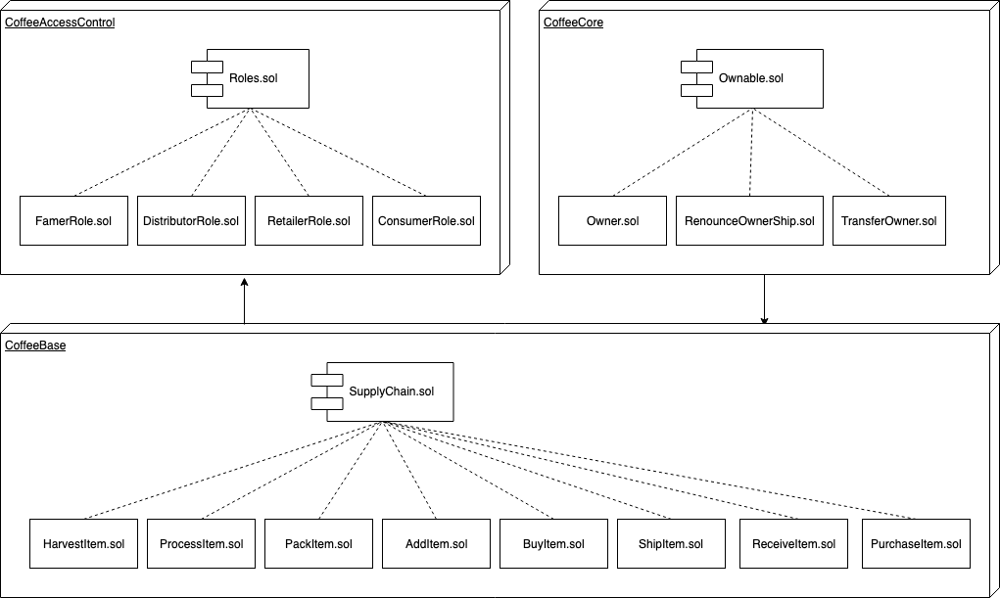

# Supply chain DAPP

A coffee bean supply chain is tracked via this Ethereum DAPP.
The DAPP was completed for the
[Udacity Blockchain Term 2 Project 6 Part B](https://www.udacity.com/course/blockchain-developer-nanodegree--nd1309).
The diagrams for Part A are in the

section towards to end of this document.
The initial skeleton code use in this repository is provided by Udacity from
[here](https://github.com/udacity/nd1309-Project-6b-Example-Template).

## Software Versions Used

- Truffle v4.1.15 (core: 4.1.15)
- Solidity v0.4.25 (solc-js)

# Rinkeby Results

The contract addresses and transaction hashs follow.

- Contract Address - 0xabce

| Event    | Transaction Hash |
| -------- | ---------------- |
| Harvest  | 0xabcd           |
| Process  | 0xabcd           |
| Pack     | 0xabcd           |
| ForSale  | 0xabcd           |
| Buy      | 0xabcd           |
| Ship     | 0xabcd           |
| Receive  | 0xabcd           |
| Purchase | 0xabcd           |

## Local Test Instructions

- Install the truffle version specified in the
  [Software Version Used](#Software-Versions-Used)
  section.
- Install browser extension [MetaMask](https://metamask.io/).
- Start the `Ganache GUI`.
- Import the accounts from the `Ganache GUI` to metamask.
- If accounts were previously imported and if necessary in `MetaMask` all the
  accounts can be reset via `Settings`->`Reset Account`.
- All the following commands should be run in the `project-6` directory.
- Run the contract tests via: `truffle test --network ganachegui`.
- Deploy the contract by running the following command in the :
  `truffle migrate --compile-all --reset --network ganachegui`.
- Start the GUI by running `npm run dev`.
- Use the web browser button in the following order to verify the contract:
  - Harvest
  - Process
  - Pack
  - ForSale
  - Buy
  - Ship
  - Receive
  - Purchase
  - Fetch Data 1
  - Fetch Data 2
- Note that role IDs shown in the web browser GUI are not used because
  the metamask role IDs are used.
- Roles can be added via the `Add Role` section of the web GUI.
  For repetitive testing the `Auto` button can be used after the role account
  ID are updated/hardcoded in `addRoles` function at the end of app.js.
- The [Sequence Diagram](#Sequence) show the sequence the contract follows.

## Coffee Supplly Chain Diagrams

### Sequence

### Activity

### State

### Class

# Notes

Can ignore everything below this as I use it as a scratch pad.

Read Student Hub from March 22/2019 on, as I read all previous comments.
